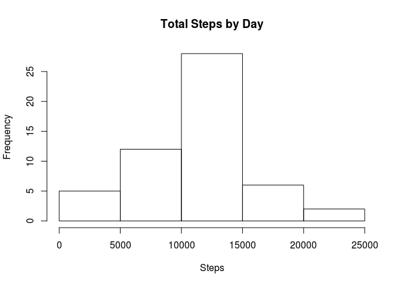
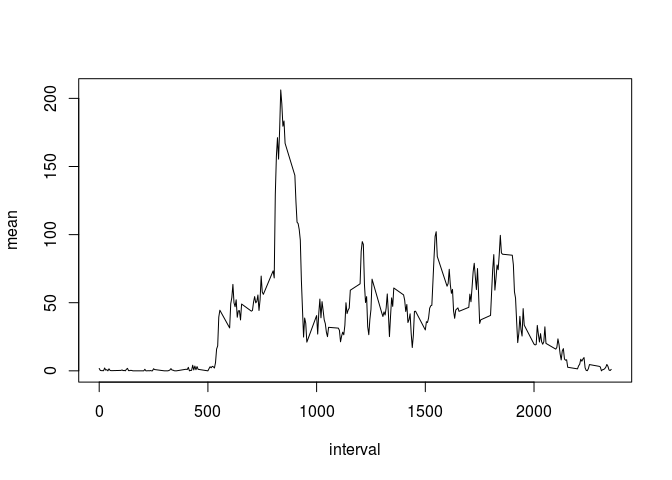
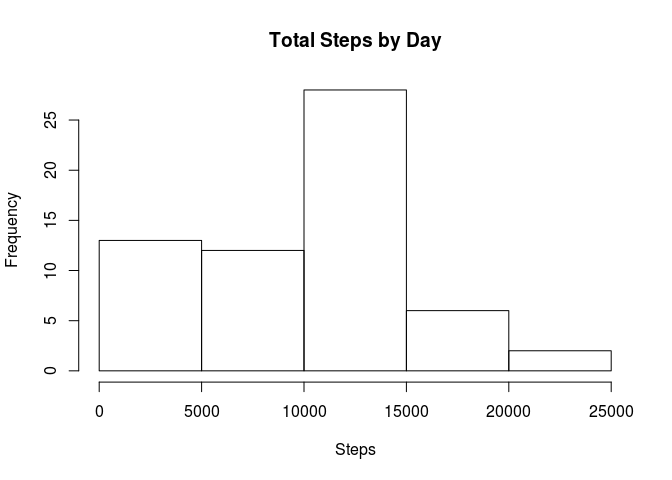
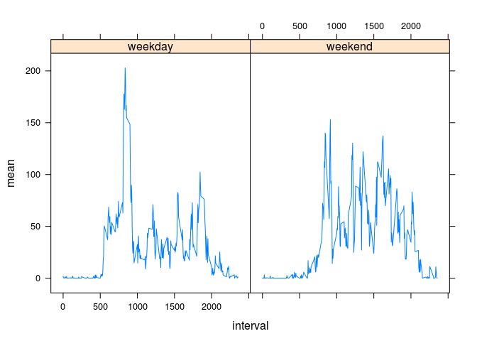

# Reproducible Research: Peer Assessment 1


```r
library(dplyr)
```

## Loading and preprocessing the data


```r
df = read.csv('activity.csv')
tbl = as_tibble(df)
tbl.filtered = tbl %>% filter(complete.cases(steps))
```

## What is mean total number of steps taken per day?


```r
dailytotal = tbl.filtered %>% group_by(date) %>%
                              summarise(dailytotal = sum(steps))
```

### Histogram


```r
hist(dailytotal$dailytotal, main = 'Total Steps by Day', xlab = 'Steps')
```

<!-- -->

### Mean


```r
mean(dailytotal$dailytotal)
```

```
## [1] 10766.19
```

### Median


```r
median(dailytotal$dailytotal)
```

```
## [1] 10765
```

## What is the average daily activity pattern?

### Time series plot


```r
int.mean = tbl.filtered %>% group_by(interval) %>%
                            summarise(mean = mean(steps))
with(int.mean, plot(interval, mean, type = 'l'))
```

<!-- -->

### Maximum number of steps


```r
summarise(int.mean, max = max(mean))
```

```
## # A tibble: 1 x 1
##        max
##      <dbl>
## 1 206.1698
```

## Imputing missing values

### Total number of rows with NAs


```r
sum(! complete.cases(tbl))
```

```
## [1] 2304
```

### NAs treatment


```r
tbl.filled = as_tibble(tbl)
tbl.filled$steps[is.na(tbl$steps)] = 0
dailytotal = tbl.filled %>% group_by(date) %>%
                            summarise(dailytotal = sum(steps))
```

### Histogram


```r
hist(dailytotal$dailytotal, main = 'Total Steps by Day', xlab = 'Steps')
```

<!-- -->

### Mean


```r
mean(dailytotal$dailytotal)
```

```
## [1] 9354.23
```

### Median


```r
median(dailytotal$dailytotal)
```

```
## [1] 10395
```

#### Do these values differ from the estimates from the first part of the assignment?

Yes, they do.

#### What is the impact of imputing missing data on the estimates of the total daily number of steps?

Both mean and median decrease.

## Are there differences in activity patterns between weekdays and weekends?


```r
as.daytype = function(x) {
    lookup = function(i) {
        if (i %in% c('Saturday', 'Sunday')) {
            'weekend'
        } else {
            'weekday'
        }
    }
    sapply(x, lookup)
}

tbl.daytype = tbl.filled %>%
              mutate(daytype = factor(as.daytype(weekdays(as.Date(date)))))
int.mean = tbl.daytype %>% group_by(daytype, interval) %>%
                           summarise(mean = mean(steps))
library(lattice)
xyplot(mean ~ interval | daytype, int.mean, type = 'l')
```

<!-- -->
